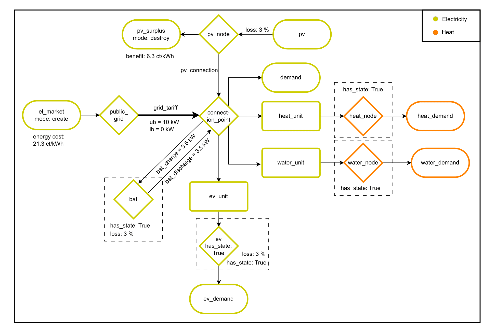

# Dynamic grid tariffs (dyn-grid-tariffs)

## 📘 Overview

This model optimizes residential electricity consumption across 200 households using the **IESopt** framework developed by the AIT Austrian Institute of Technology. It was developed as part of the master's thesis:

**_Impact of Dynamic Electricity Grid Tariffs on Charging Behavior of Private Electric Vehicles_**

The objective is to evaluate how different grid tariff structures influence household energy costs and battery electric vehicle (BEV) charging behavior. The model integrates flexible energy technologies such as:

- Battery Electric Vehicles (BEVs)  
- Photovoltaic systems (PVs)  
- Battery Energy Storage Systems (BESSs)  
- Heat Pumps (HPs)

The optimization is performed at 15-minute resolution over a full year and considers both consumption-based and capacity-based tariffs.
---

## 🏠 Household Configuration

- **200 households** total  
  - 160 flexible (with combinations of BEV, PV, BESS, HP)  
  - 40 inflexible (fixed demand only)  
- Each household has a grid connection limited to 10 kW  
- Flexible consumers optimize their energy usage to minimize costs

---

## 🔄 Energy Flow Model

The system is modeled using interconnected components representing energy generation, consumption, and storage. The model includes two energy carriers:

- **Electricity** (yellow components)
- **Heat** (orange components)

### 🔌 Electricity Flow

- **PV Node** → supplies energy to BEV, HP, fixed demand, and BESS  
- **BESS** → charges from PV surplus or grid, discharges during high demand  
- **Public Grid** → one-way connection to household (no feed-in)  
- **Electricity Market** → represents cost of purchased electricity (21.3 ct/kWh)

### 🔥 Heat Flow

- **Heat Pump Unit** → converts electricity to heat using a COP  
- **Heat Node** → stores thermal energy for space heating  
- **Water Node** → stores energy for domestic hot water (DHW)

Some components are subject to efficiency losses (typically 3%) and operational constraints (e.g., BEV charging limited to 0–11 kW).

---

## 🧩 Model Diagram (Conceptual)

- Arrows indicate direction of energy flow  
- Circular nodes represent storage (`has_state: True`)  
- Rectangles represent conversion units (e.g., HP, BEV)  
- Energy losses and tariff costs are applied at each relevant step

---

## 📦 Framework: IESopt

- Modular, block-based optimization framework  
- Supports multi-carrier energy systems  
- Designed for ease of use and scalability  
- Developed by AIT’s Center for Energy, Integrated Energy Systems

---

## 📁 Files & Structure

- `model_config.json` – defines household configurations and tariff scenarios  
- `files/` – contains time series for inflexible demand, PV, BEV, HP, TOU tariff timeseries and a household_summary which contains necessary informations or references to other files.
- `...iesopt.yaml`- each yaml file is a different scenario
- `addons/`- for some scenarios (mpd_model.iesopt.yaml, mpd-50_inc_4kW.iesopt.yaml, mpd-50_inc.iesopt.yaml, mpd-50_model.iesopt.yaml) addons have been necessary
- `main.py` - executes the .yaml files
- `...py`- these files are primarily related to result extraction and handling